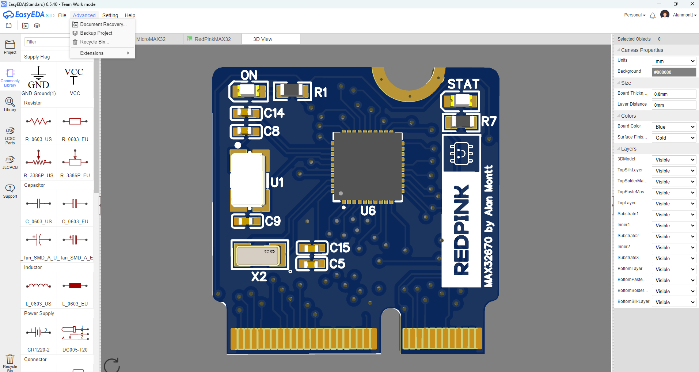
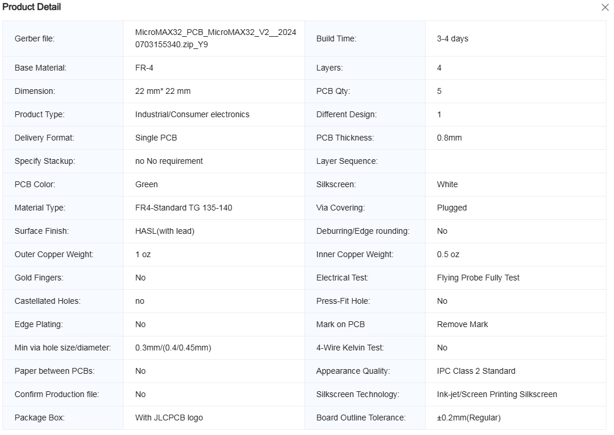
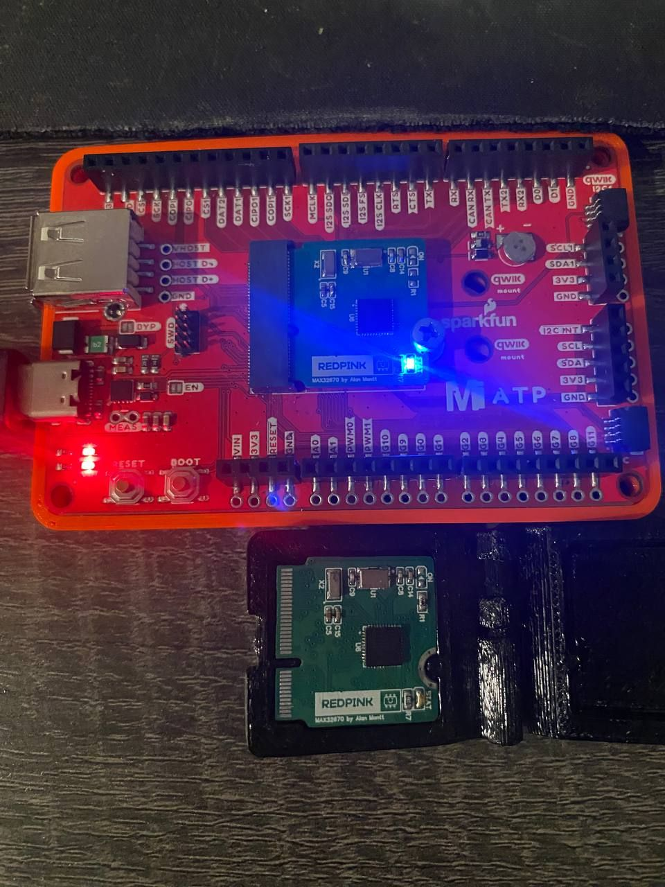
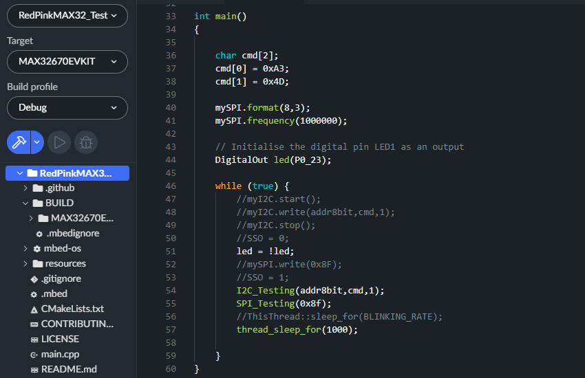

# RedPink MAX32 for MicroMod Ecosystem
This is the first prototype for a custom board for MAX32 Microcontrollers from Maxim Integrated - Analog Devices.
RedPink MAX32" MicroMod-Compatible 4 Layers - Board designed on EasyEDA. 
## Features:
- MCU: MAX32670 (ARM Cortex-M4 with FPU)
- Crystal: 32MHz
- Peripherals: UART, 2xSPI, 2xI2C, 10xGPIO, 1xFLASH
## 3D Model

## Fabrication Rules:
First set of prototypes were fabricated at JLCPCB. Please be careful with the board thickness of **0.8mm**

## Components:
List of components can be found on BOM_MicroMAX32.csv
## Prototype fabricated:
RedPink MAX32 working on MicroMod ATP. First prototype under revision.

## Firmware
For testing the board it is necessary to use mbed Studio, implementing main.cpp file and BUILD folder (which contains MAX32670EVKIT) into the mbed project. 

## Tested:
Testing the communication was done by using a Logic Analyzer.
- I2C
- SPI
- GPIO
- mBed OS Threads
- LED

## Under Revision:
- Flash Memory 128Mbit
